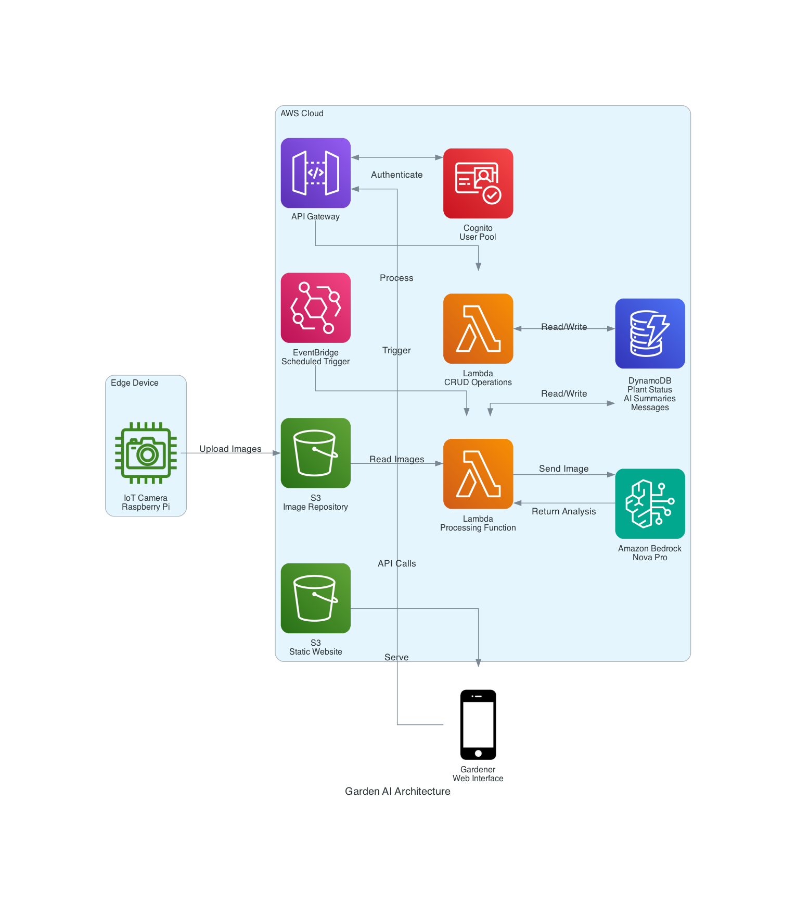

# Garden AI

An experimental plant monitoring system that uses AI to analyze plant health and communicate with gardeners.

## Overview

Garden AI is a smart plant monitoring system that combines edge computing with AWS cloud services and AI to provide automated plant care assistance. The system captures regular images of plants, analyzes their health using AI, and communicates with human gardeners when intervention is needed.

This project is designed to study interaction patterns between AI and human actors over the longer timescale of plant growth. By creating an asynchronous communication framework where both the AI and gardener operate independently, the system allows for observation of how these interactions evolve over time.

## Features

- Automated image capture of plants at regular intervals
- AI-powered analysis of plant health and growth
- Identification of potential issues (diseases, pests, nutrient deficiencies)
- Automated notifications to gardeners when action is needed
- Two-way communication between the system and gardeners
- Historical tracking of plant growth and health

## System Components

- **Edge Device**: Raspberry Pi with camera module
- **Cloud Infrastructure**: AWS S3, Lambda, DynamoDB, EventBridge
- **AI Analysis**: Amazon Bedrock Nova Pro foundation model
- **Communication**: Web interface for asynchronous interaction

## Architecture

The system uses a cloud-based architecture with edge devices for data collection:

For detailed information about the system architecture, please see:
- [architecture.md](architecture.md) - Detailed architecture description
- [architecture_diagram.md](architecture_diagram.md) - Mermaid-based architecture diagram
- [aws_architecture_diagram.md](aws_architecture_diagram.md) - AWS architecture diagram using official service icons

## Research Proposal

This project is part of a research initiative to study long-timescale agentic systems. The full research proposal is available in:
- [Markdown format](research_proposal/research_proposal.md)
- [PDF format](research_proposal/latex/output/research_proposal.pdf)

## Implementation Plan

The project follows an Agile approach with four phases:

1. **Technical Proof of Concept** (3 months): Single plant monitoring system
2. **Pattern Exploration** (4 months): Multiple plants managed by a single AI
3. **Comparative Models** (5 months): Testing multiple AI approaches with parallel plant environments
4. **Synthesis and Theory Development** (2 months): Analysis and framework development

## Project Status

This project is currently in experimental phase.

## License

This project is licensed under the Apache 2.0 open source license.