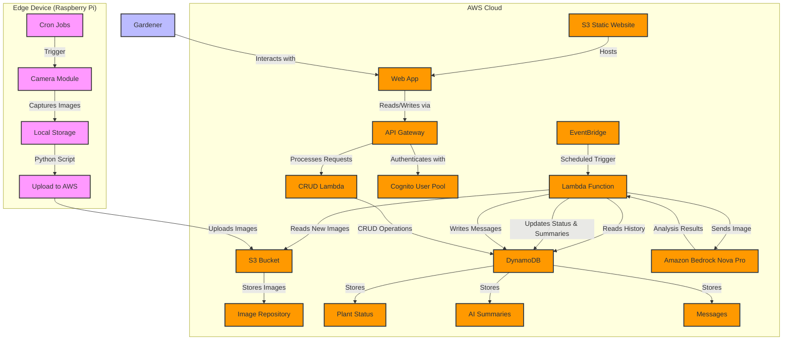

# Garden AI Architecture Diagram

Below is a diagram of the Garden AI system architecture using Mermaid syntax. You can render this diagram using various Mermaid-compatible tools or websites like [Mermaid Live Editor](https://mermaid.live/).

For an alternative diagram using official AWS service icons, see [aws_architecture_diagram.md](aws_architecture_diagram.md).

