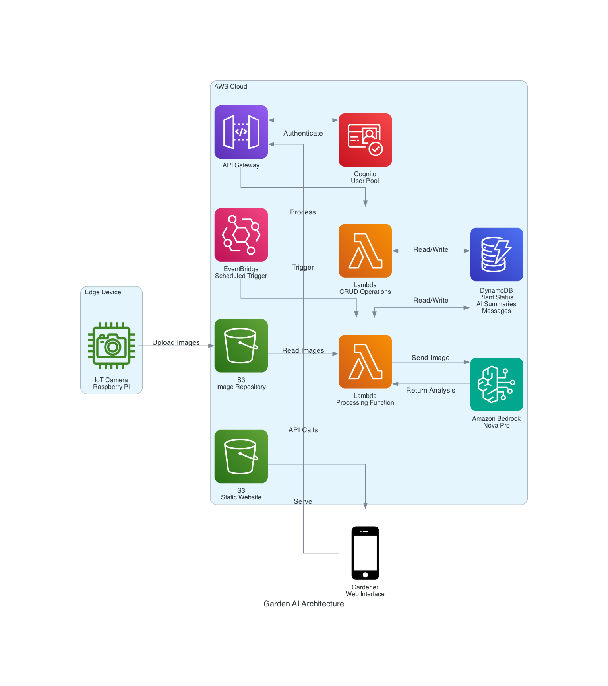

# Research Proposal: Investigating Interaction Patterns in Long-Timescale Agentic Systems

Principal Investigator: David Rostcheck (david@rostcheck.com), Independent Researcher

6/13/25

## 1. Introduction

The field of artificial intelligence has made remarkable strides in developing systems capable of sophisticated knowledge representation, reasoning, and task execution. However, a significant limitation persists in current AI architectures: their inability to effectively operate over extended timescales while maintaining goal-directed behavior and meaningful human collaboration. This research proposes to investigate the patterns of interaction that emerge in agentic systems designed to operate over prolonged periods (days, weeks, or months) through the development and analysis of an experimental plant monitoring system called Garden AI.

## 2. Background and Significance

### 2.1 The Cognitive Light Cone

All cognitive actors operate within what biologist Michael Levin terms a "cognitive light cone" - the scope of the largest goal they can engage with based on their substrate, input/output mechanisms, and operational timescale [1]. Current AI systems typically operate within a narrow cognitive light cone constrained by:

1. Short-term interaction patterns (chat-based turns)
2. Limited tool access (primarily informational)
3. Inability to maintain context and goal orientation across extended periods
4. Lack of mechanisms for asynchronous human collaboration
5. Limited practices within AI agent teams for effectively doing collaborative work together

These constraints fundamentally limit the domains in which AI systems can effectively operate, restricting them to problems that can be solved within short timeframes and with immediate human guidance.

### 2.2 The Knowledge-Goal Gap

A critical distinction exists between systems designed for knowledge management (explaining, summarizing, analyzing) and those capable of pursuing overarching goals that require knowledge acquisition, reasoning, and action as components of execution. Current systems excel at the former but struggle with the latter, particularly when goals require sustained attention over longer periods [2].

### 2.3 Timescale as a Critical Dimension

Time represents a crucial dimension in cognitive systems that has been underexplored in AI research. The ability to incorporate new information, adjust strategies, and maintain goal orientation across varying timescales is essential for addressing complex problems. Natural processes like plant growth operate on timescales that are slow by computational standards but rapid enough to observe meaningful patterns within a research timeframe, making them ideal for studying long-timescale agent behavior. [3][4]

## 3. Research Questions

This research aims to address the following questions:

1. What interaction patterns emerge between AI agents and human collaborators when operating over extended timescales?
2. How do these patterns differ from those observed in short-term, synchronous interactions?
3. What architectural components are necessary to support effective long-timescale agentic behavior?
4. How does the agent's ability to store and retrieve historical context affect its decision-making and goal pursuit?
5. What mechanisms facilitate effective asynchronous collaboration between humans and AI systems?

### 3.1 Limitations

The behavior of multi-agent systems at extended timescales represents a significant problem that is not yet studied, but will not be reached in this research. Operating at these timescales may require different approaches than commonly used in current AI agent engineering, which implicitly assumes shorter timescales due to the turn-based nature of chat interactions, which is the default training mode for most current models. 

## 4. Methodology

### 4.1 Experimental System: Garden AI

We propose developing Garden AI, an experimental plant monitoring system that combines edge computing with cloud infrastructure and AI to provide automated plant care assistance. The system will evolve through iterative development, beginning with a single-plant proof of concept and potentially expanding to multiple comparative models.

#### Initial Proof of Concept:
1. Capture regular images of a single plant at scheduled intervals (1-2 times daily)
2. Analyze plant health using the Amazon Bedrock Nova Pro foundation model
3. Maintain historical records of plant development and AI observations
4. Communicate asynchronously with human gardeners through a web interface
5. Track all interactions, decisions, and outcomes over the plant's growth cycle

#### Potential Expansion (based on initial findings):
1. Deploy multiple instances monitoring identical plant species in similar conditions
2. Implement variations in AI models or interaction patterns to compare approaches
3. Introduce controlled challenges (e.g., simulated pest infestations) to observe response patterns
4. Explore different communication cadences and interaction styles

### 4.2 System Architecture

The Garden AI system will be implemented using the following components:

- **Edge Device**: Raspberry Pi with camera module for image capture
- **Cloud Infrastructure**: AWS services including S3, Lambda, DynamoDB, EventBridge
- **AI Analysis**: Amazon Bedrock Nova Pro foundation model
- **Communication**: Web application interface for asynchronous interaction
- **Data Storage**: NoSQL database for plant status, AI summaries, and message history

### 4.3 Data Collection

The research will collect the following data:

1. **Temporal Interaction Patterns**: Frequency, duration, and nature of AI-human interactions
2. **Decision Quality**: Accuracy and effectiveness of AI recommendations over time
3. **Context Utilization**: How effectively the AI leverages historical information
4. **Goal Alignment**: Consistency of AI actions with the overarching goal of plant health
5. **Adaptation Patterns**: How the AI adjusts strategies based on plant response and human feedback

### 4.4 Analysis Methods

Data will be analyzed using:

1. Temporal pattern analysis to identify interaction rhythms and cycles
2. Qualitative coding of AI-human communications to identify emerging patterns
3. Comparative analysis between short-term and long-term decision quality
4. Evaluation of goal persistence and drift over extended periods
5. In later phases, evaluation of plant health and agricultural yield

## 5. Expected Outcomes and Contributions

This research is expected to yield the following contributions:

1. **Architectural Insights**: Identification of essential components for long-timescale agentic systems
2. **Interaction Patterns**: Documentation of novel interaction patterns that emerge in asynchronous, extended collaborations
3. **Design Principles**: Guidelines for designing AI systems capable of operating effectively across varying timescales
4. **Domain Expansion**: Framework for expanding the cognitive light cone of AI systems to address problems requiring extended temporal engagement
5. **Practical Applications**: Demonstration of a functional system that can maintain goal-directed behavior while accommodating the natural rhythm of biological processes

## 6. Theoretical Framework

The research will draw upon several theoretical frameworks:

### 6.1 Cognitive Light Cone Theory

Building on Michael Levin's concept, we will explore how expanding an agent's temporal domain affects its problem-solving capabilities and interaction patterns.

### 6.2 Extended Agency

Drawing from theories of extended cognition, we will investigate how an agent's capabilities are enhanced through persistent storage of observations and plans.

### 6.3 Asynchronous Collaboration Models

Examining how effective collaboration can occur when participants operate on different timescales and with different availability patterns.

## 7. Implementation Plan: Agile Research Approach

Rather than following a traditional waterfall research methodology, this project will adopt an Agile approach with iterative development cycles and continuous learning. This approach is particularly well-suited for exploring emergent phenomena in complex systems where requirements and insights evolve throughout the research process.

### 7.1 Phase 1: Technical Proof of Concept (3 months)
- **Goal**: Establish technical foundation and explore basic interaction patterns
- **Activities**:
  - Develop minimal viable system with a single plant
  - Implement core infrastructure (image capture, AI analysis, communication)
  - Document emergent issues and interaction patterns
  - Weekly review and adaptation cycles
- **Deliverables**: Working prototype, technical documentation, preliminary observations report

### 7.2 Phase 2: Pattern Exploration (4 months)
- **Goal**: Refine system based on Phase 1 learnings and explore deeper interaction patterns
- **Activities**:
  - Implement improvements based on Phase 1 findings
  - Extend scope by adding additional plants and supporting IoT camera hardware for a single AI to manage (expect ~5 plants per gardener)
  - Extend observation period to capture longer-term patterns
  - Begin comparative analysis of interaction types
  - Bi-weekly research sprints with defined objectives
- **Deliverables**: Refined system, initial pattern catalog, mid-project research report

### 7.3 Phase 3: Comparative Models (5 months)
- **Goal**: Test multiple AI approaches with parallel plant environments
- **Activities**:
  - Deploy multiple instances of the system with different plants in similar conditions
  - Introduce heterogeneous plants, exploring the AI's ability to manage a more complex ecosystems
  - Implement variations in AI models or interaction patterns
  - Compare responses to similar challenges (e.g., pest infestations, nutrient deficiencies)
  - Monthly research reviews and direction adjustments
- **Deliverables**: Comparative analysis report, model effectiveness evaluation

### 7.4 Phase 4: Synthesis and Theory Development (2 months)
- **Goal**: Synthesize findings and develop theoretical framework
- **Activities**:
  - Comprehensive analysis of all collected data
  - Development of design principles for long-timescale agentic systems
  - Formulation of testable hypotheses for future research
  - Final research review and documentation
- **Deliverables**: Final research report, design principles guide, academic publication drafts

Each phase will include regular retrospectives to assess progress, identify emerging insights, and adjust subsequent activities accordingly. This Agile approach allows the research to respond to unexpected findings and evolve as our understanding of long-timescale agent interactions deepens.

## 8. Broader Impacts

This research has potential implications for numerous domains requiring long-term goal pursuit, including:

1. **Scientific Research**: Supporting extended experimental processes
2. **Healthcare**: Monitoring chronic conditions and treatment adherence
3. **Education**: Providing sustained learning support across academic terms
4. **Environmental Monitoring**: Tracking ecological changes over seasons or years
5. **Project Management**: Assisting with complex projects spanning months or years

## 9. Budget

The budget for this research project is structured to align with the Agile, phased approach. Each phase builds upon previous work and expands the scope incrementally, with corresponding resource requirements.

### 9.1 Phase 1: Technical Proof of Concept (3 months)
| Item | Monthly Cost | Total (3 months) | Notes |
|------|--------------|------------------|-------|
| AWS Services | $75 | $225 | S3 storage, Lambda functions, DynamoDB, Bedrock API usage |
| Seeds and Gardening Supplies | $50 | $50 | One-time purchase of basic supplies |
| Miscellaneous | $25 | $75 | Cables, adapters, etc. |
| **Phase 1 Total** | | **$350** | |

*Note: Phase 1 utilizes existing Raspberry Pi hardware and camera equipment.*

### 9.2 Phase 2: Pattern Exploration (4 months)
| Item | Monthly Cost | Total (4 months) | Notes |
|------|--------------|------------------|-------|
| AWS Services | $125 | $500 | Increased usage for multiple plants |
| Raspberry Pi Units (4) | - | $280 | $70 each, one-time purchase |
| Camera Modules (4) | - | $120 | $30 each, one-time purchase |
| Additional Plant Lights | - | $150 | One-time purchase |
| Soil, Pots, and Gardening Supplies | - | $200 | For additional plants |
| Miscellaneous | $50 | $200 | Cables, adapters, sensors, etc. |
| **Phase 2 Total** | | **$1,450** | |

### 9.3 Phase 3: Comparative Models (5 months)
| Item | Monthly Cost | Total (5 months) | Notes |
|------|--------------|------------------|-------|
| AWS Services | $200 | $1,000 | Multiple AI instances, increased storage and processing |
| Growing Racks | - | $350 | Shelving systems for organized plant arrangement |
| Additional Plant Lights | - | $300 | For expanded growing area |
| Video Monitoring Equipment | - | $400 | Higher quality cameras, monitoring stations |
| Environmental Sensors | - | $250 | Temperature, humidity, soil moisture sensors |
| Gardening Supplies | - | $300 | Specialized soil, nutrients, pest management |
| Miscellaneous | $100 | $500 | Cables, adapters, backup equipment, etc. |
| **Phase 3 Total** | | **$3,100** | |

### 9.4 Phase 4: Synthesis and Theory Development (2 months)
| Item | Monthly Cost | Total (2 months) | Notes |
|------|--------------|------------------|-------|
| AWS Services | $150 | $300 | Continued operation during analysis phase |
| Data Analysis Software | - | $100 | Specialized software licenses if needed |
| Publication Preparation | - | $200 | Graphics, formatting, submission fees |
| **Phase 4 Total** | | **$600** | |

### 9.5 Total Project Budget
| Phase | Duration | Total Cost |
|-------|----------|------------|
| Phase 1: Technical Proof of Concept | 3 months | $350 |
| Phase 2: Pattern Exploration | 4 months | $1,450 |
| Phase 3: Comparative Models | 5 months | $3,100 |
| Phase 4: Synthesis and Theory Development | 2 months | $600 |
| **Total Project Budget** | **14 months** | **$5,500** |

*Note: This budget does not include labor costs. All equipment will be retained for future research after project completion.*

## 10. Conclusion

The proposed research addresses a fundamental limitation in current AI systems: their inability to effectively operate over extended timescales while maintaining goal-directed behavior. By developing and studying Garden AI through an iterative, Agile approach, we aim to identify the architectural components, interaction patterns, and design principles necessary to expand the temporal domain of AI systems, enabling them to address problems that require sustained attention and adaptation over longer periods.

This work represents a shift from viewing AI primarily as a tool for immediate knowledge management to understanding it as a potential collaborator in extended goal pursuit - a transition that may significantly expand the range of problems AI can meaningfully address. By starting with a focused proof of concept and allowing our research direction to evolve based on emergent findings, we create space for discovering unexpected patterns and insights that might be missed in a more rigid research framework.

The Agile methodology employed in this research mirrors the adaptive nature we hope to foster in long-timescale AI systems themselves - responding to changing conditions, incorporating new information, and maintaining goal orientation despite evolving circumstances.at may significantly expand the range of problems AI can meaningfully address.

## 11. Licensing

Code artifacts developed under this proposal will be licensed under the Apache 2.0 Open Source license and freely distributed on GitHub. Resulting research papers will be published in open preprint form to the extent allowed by publishers' licenses. Final publications, if accepted to academic journals, may be restricted in access and require journal subscription. Data will be made freely available on GitHub.

## 12. AI Disclosure

This proposal was written by the Principal Investigator using Amazon Q Developer (6/13/25) operating on the PI's notes and the system architecture documents, with subsequent hand editing. Anthropic Claude Sonnet 3.7 and 4 were used as research advisors. Perplexity.ai was used to assist in literature search.

## 13. AI Safety

The agentic AI system proposed in this research does not have direct agency over the world; its action is limited to sending messages to a human gardener, who carries out requests. Limiting the AI to indirect agency and a limited domain (gardening) reduces safety concerns to a minimum [5]. The gardener is assumed to be familiar with and to utilize basic agricultural safety protocols in conducting gardening activities.

## References

[1] Levin, Michael. “The Computational Boundary of a ‘Self’: Developmental Bioelectricity Drives Multicellularity and Scale-Free Cognition.” Frontiers in Psychology 10 (2019): 2688. https://doi.org/10.3389/fpsyg.2019.02688.

[2] Krishnan, Naveen. 2025. "AI Agents: Evolution, Architecture, and Real-World Applications." arXiv, March 16, 2025. https://arxiv.org/abs/2503.12687.

[3] Clark, A., & Chalmers, D. (1998). The extended mind. Analysis, 58(1), 7-19. (Section 6.2 on Extended Agency)

[4] Jiang, Xun, Feng Li, Han Zhao, Jiahao Qiu, Jiaying Wang, Jun Shao, Shihao Xu, Shu Zhang, Weiling Chen, Xavier Tang, Yize Chen, Mengyue Wu, Weizhi Ma, Mengdi Wang, and Tianqiao Chen. 2025. "Long Term Memory: The Foundation of AI Self-Evolution." arXiv, May 11, 2025. https://arxiv.org/abs/2410.15665.

[5] Osogami, Takayuki. 2025. "AI Agents Should Be Regulated Based on the Extent of Their Autonomous Operations." arXiv, May 26, 2025. https://arxiv.org/abs/2503.04750.